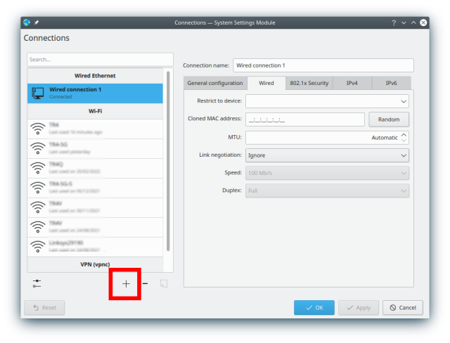
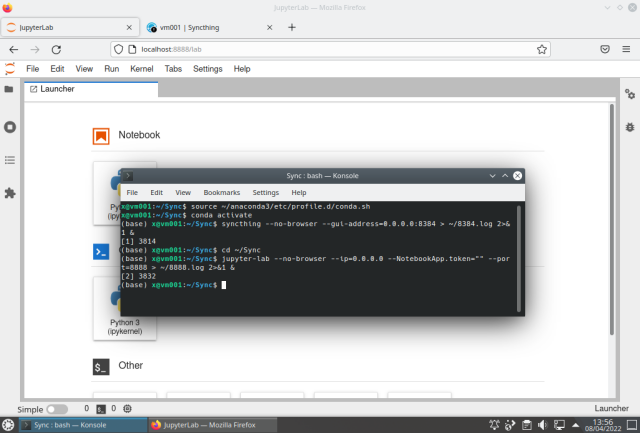
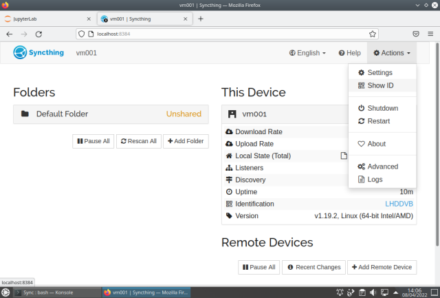
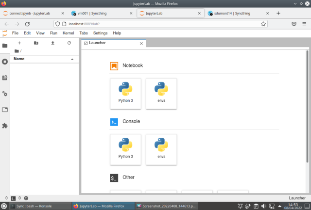
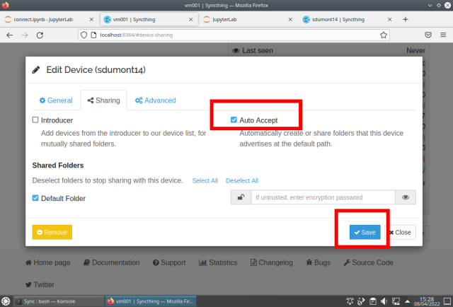

# SDumont environment setup

This page shows a simple step-by-step to configure a basic and functional JupyterLab (JL) environment for use on the local machine (PC) and also on the LNCC Santos Dumont (SDumont) supercomputer on a login node. This is the configuration I am using in my works.

Some of the reasons to run JL on SDumont are:

- Use the interactive features of the JL/Python environment directly on the target machine
- Use the packages, tools, and hardware available on SDumont
- Debug directly on the machine where the application will run
- Use tools that generate native code (like Cython, F2FY, Numba, etc.) directly on the target machine
- View and analyze results as they are ready, in such a way as to reduce development time

This page is not intended to be complete, it is a simple step by step that I use to work in SDumont. For this setup, I'm conveniently using a PC running Kubuntu 22.04. What will be seen next is:

- Installing the Anaconda distribution (on the local machine), and running JL
- VPN configuration for accessing the SDumont, using the os's network manager
- Configuring SSH to use key instead of password, and also using the ControlMaster feature that keeps the connection alive
- Configure the conda environment, and install the Syncthing (ST) package
- Configure ST to keep directories synchronized between machines;
- Run JL on both local and SDumont machines

## Anaconda install (local machine)

Let's start by installing the Anaconda distribution on the local machine, and for that we are going to download it, and this can be done either through the browser or the CLI:


Download and install. Please replace "Anaconda3-2021.11-Linux-x86_64.sh" with the latest version, or another one you prefer:

```bash
$ cd Downloads/
$ wget https://repo.anaconda.com/archive/Anaconda3-2021.11-Linux-x86_64.sh
$ chmod +x Anaconda3-2021.11-Linux-x86_64.sh
$ bash Anaconda3-2021.11-Linux-x86_64.sh -b
```

  
  


Running JupyterLab to check if it's already working (the web browser will run automatically and the JL will appear):

```bash
$ source ~/anaconda3/etc/profile.d/conda.sh
$ conda activate
$ jupyter-lab
```


At this point the Anaconda distribution is installed and JupyterLab is running on the local machine. 

## VPN setup (local machine)

Let's now configure the network manager to access the SDdumont VPN. The steps to be followed are contained in the detailed information provided by the LNCC, and only part of it is reproduced here. The following text assumes that you already have an SDdumont account.

We will need the network-manager-vpnc:

```bash
$ sudo apt install network-manager-vpnc
```

After that, enter the Network Manager, Configure Network Connections, add a connection, and chose Cisco Compatible VPN (vpnc):



Select Cisco Compatible VPN (vpnc):


The following screen must be completed according to the instructions provided by the LNCC:


We are now going to configure the route to change the behavior of the traffic and make sure that only the resources you want from SDumont pass through this interface, and not all the traffic, and in this way it is possible to use the internet connection of the local machine normally without interference:


Insert (+ Add) the Address 146.134.143.249, Netmask (accept the default), select "Use only for resources on this connection", "Ignore automatically obatined routes", and save the connection (OK):

 

Then, through the network manager, make the connection, and it should appear connected:


## SSH setup

The next step is to configure SSH to use keys (and not passwords), and the steps include creating the key and copying it to the SDdumont user area.  The `~/.ssh/config` file on the local machine would look like this:

```
...
qHost sd
        ServerAliveInterval 120
        IPQoS=throughput
        HostName login.sdumont.lncc.br
        User <username>
        ControlMaster auto
        ControlPath ~/.ssh/remote_sd
...
```

The `<username>` needs to be replaced with your username. The option called ControlMaster allows sharing of multiple sessions on a single network connection, so when connecting to the cluster (using `ssh -Nf sd`) the connection is active, and all subsequent ssh sessions (including svn, rsync , etc. ) do not need authentication. At the end of use, it is necessary to end the connection with the command `ssh -O exit sd`. Creating the key:

```bash
$ ssh-keygen -t ed25519
Generating public/private ed25519 key pair.
Enter file in which to save the key (/home/<username>/.ssh/id_ed25519): 
Created directory '/home/<username>/.ssh'.
Enter passphrase (empty for no passphrase): 
Enter same passphrase again: 
Your identification has been saved in /home/<username>/.ssh/id_ed25519
Your public key has been saved in /home/<username>/.ssh/id_ed25519.pub
The key fingerprint is:
SHA256:+yk+H(...)/0AuM x@vm001
The key's randomart image is:
+--[ED25519 256]--+
|   . . .         |
|  . o + .        |
| . + + + o       |
|o.. * . + o      |
|o. o . ESo .     |
|.o  .    ...     |
|o o     o o      |
|.=.o ..o+* o     |
|ooO+.o=BO**      |
+----[SHA256]-----+
```

Copy the SSH key to the user area on the SDdumont:

```bash
$ ssh-copy-id <username>@login.sdumont.lncc.br
/usr/bin/ssh-copy-id: INFO: Source of key(s) to be installed: "/home/<username>/.ssh/id_ed25519.pub"
The authenticity of host 'login.sdumont.lncc.br (146.134.143.249)' can't be established.
ECDSA key fingerprint is SHA256:FZQP(...)JnyI.
Are you sure you want to continue connecting (yes/no/[fingerprint])? yes
/usr/bin/ssh-copy-id: INFO: attempting to log in with the new key(s), to filter out any that are already installed
/usr/bin/ssh-copy-id: INFO: 1 key(s) remain to be installed -- if you are prompted now it is to install the new keys
<username>@login.sdumont.lncc.br's password: 

Number of key(s) added: 1

Now try logging into the machine, with:   "ssh '<username>@login.sdumont.lncc.br'"
and check to make sure that only the key(s) you wanted were added.
```

At this point, if everything was configured correctly, it is already possible to access without password:

```bash
$ ssh sd
Last login: Mon Feb 17 16:25:20 2025 from 146.134.223.65
[<username>@sdumont17 ~]$ 
```

The next step now is to configure a Conda Environment (CE) to be used on the SDdumont. SDdumont already has some versions of the Anaconda distribution installed, selectable via the `module` command:

```bash
$ module avail 2>&1 | grep -i Anaconda
   anaconda2/2019.10_sequana
   anaconda3/5.2.0_sequana
   anaconda3/2020.02_sequana
   anaconda3/2020.07_sequana
   anaconda3/2020.11
   anaconda3/2024.02_sequana                                     (D)
$ module load anaconda3
$ conda list _anaconda_depends
# packages in environment at /scratch/app_sequana/anaconda3/2024.02:
#
# Name                    Version                   Build  Channel
_anaconda_depends         2024.02             py311_mkl_1  
$ conda env list  
# conda environments:
base                     /scratch/app_sequana/anaconda3/2024.02
```

Load JupyterLab:

```bash
$ source /scratch/app_sequana/anaconda3/2024.02/etc/profile.d/conda.sh
$ conda activate
(base) $ jupyter-lab --no-browser --ip=0.0.0.0 --NotebookApp.token="" --port=8888
[I 2025-03-08 15:31:25.220 ServerApp] Package jupyterlab took 0.0000s to import
[I 2025-03-08 15:31:27.031 ServerApp] Package jupyter_lsp took 1.8101s to import
[W 2025-03-08 15:31:27.031 ServerApp] A `_jupyter_server_extension_points` function was not found in jupyter_lsp. Instead, a `_jupyter_server_extension_paths` function was found and will be used for now. This function name will be deprecated in future releases of Jupyter Server.
[I 2025-03-08 15:31:27.765 ServerApp] Package jupyter_server_terminals took 0.7339s to import
[I 2025-03-08 15:31:27.765 ServerApp] Package notebook took 0.0000s to import
[I 2025-03-08 15:31:27.790 ServerApp] Package notebook_shim took 0.0000s to import
[W 2025-03-08 15:31:27.790 ServerApp] A `_jupyter_server_extension_points` function was not found in notebook_shim. Instead, a `_jupyter_server_extension_paths` function was found and will be used for now. This function name will be deprecated in future releases of Jupyter Server.
[I 2025-03-08 15:31:47.416 ServerApp] Package panel.io.jupyter_server_extension took 19.5883s to import
[I 2025-03-08 15:31:47.416 ServerApp] jupyter_lsp | extension was successfully linked.
[I 2025-03-08 15:31:47.422 ServerApp] jupyter_server_terminals | extension was successfully linked.
[W 2025-03-08 15:31:47.424 LabApp] 'token' has moved from NotebookApp to ServerApp. This config will be passed to ServerApp. Be sure to update your config before our next release.
[W 2025-03-08 15:31:47.426 ServerApp] ServerApp.token config is deprecated in 2.0. Use IdentityProvider.token.
[I 2025-03-08 15:31:47.426 ServerApp] jupyterlab | extension was successfully linked.
[I 2025-03-08 15:31:47.430 ServerApp] notebook | extension was successfully linked.
[I 2025-03-08 15:32:12.230 ServerApp] notebook_shim | extension was successfully linked.
[I 2025-03-08 15:32:12.230 ServerApp] panel.io.jupyter_server_extension | extension was successfully linked.
[W 2025-03-08 15:32:13.640 ServerApp] All authentication is disabled.  Anyone who can connect to this server will be able to run code.
[I 2025-03-08 15:32:13.640 ServerApp] notebook_shim | extension was successfully loaded.
[I 2025-03-08 15:32:13.642 ServerApp] jupyter_lsp | extension was successfully loaded.
[I 2025-03-08 15:32:13.643 ServerApp] jupyter_server_terminals | extension was successfully loaded.
[I 2025-03-08 15:32:13.816 LabApp] JupyterLab extension loaded from /scratch/app_sequana/anaconda3/2024.02/lib/python3.11/site-packages/jupyterlab
[I 2025-03-08 15:32:13.816 LabApp] JupyterLab application directory is /petrobr/app_sequana/anaconda3/2024.02/share/jupyter/lab
[I 2025-03-08 15:32:13.929 LabApp] Extension Manager is 'pypi'.
[I 2025-03-08 15:32:13.931 ServerApp] jupyterlab | extension was successfully loaded.
[I 2025-03-08 15:32:13.937 ServerApp] notebook | extension was successfully loaded.
[I 2025-03-08 15:32:13.938 ServerApp] panel.io.jupyter_server_extension | extension was successfully loaded.
[I 2025-03-08 15:32:13.938 ServerApp] Serving notebooks from local directory: /prj/ampemi/eduardo.miranda2
[I 2025-03-08 15:32:13.938 ServerApp] Jupyter Server 2.10.0 is running at:
[I 2025-03-08 15:32:13.938 ServerApp] http://sdumont18:8888/lab
[I 2025-03-08 15:32:13.938 ServerApp]     http://127.0.0.1:8888/lab
[I 2025-03-08 15:32:13.938 ServerApp] Use Control-C to stop this server and shut down all kernels (twice to skip confirmation).
[I 2025-03-08 15:32:14.310 ServerApp] Skipped non-installed server(s): bash-language-server, dockerfile-language-server-nodejs, javascript-typescript-langserver, jedi-language-server, julia-language-server, pyright, python-language-server, r-languageserver, sql-language-server, texlab, typescript-language-server, unified-language-server, vscode-css-languageserver-bin, vscode-html-languageserver-bin, vscode-json-languageserver-bin, yaml-language-server
```

Let's create an empty conda environment in the user area and activate it. The new conda environment will be created in the `scratch/` area so that programs running on the execution nodes can access it:

```bash
(base) $ conda create --prefix /scratch${HOME#/prj}/env01
Channels:

- defaults
  Platform: linux-64
  Collecting package metadata (repodata.json): done
  Solving environment: done

## Package Plan

  environment location: /scratch/xxxx/env01

Proceed ([y]/n)?

Preparing transaction: done
Verifying transaction: done
Executing transaction: done
#
# To activate this environment, use
# 
# $ conda activate /scratch/ampemi/eduardo.miranda2/env01
# 
# To deactivate an active environment, use
# 
# $ conda deactivate

(base) $
```

And to activate:

    (base) $ conda activate /scratch${HOME#/prj}/env01
    (/scratch/xxxx/env01) $

## ST setup (on SDumont)

The main purpose of `syncthing` (ST) is to have a mirror directory automatically and constantly synchronized between the local machine and SDdumont, so that we don't have to remember to copy files from one machine to another, or worry about what else is updated where, thus automating a part of the workflow. ST also works similarly to JL, with client/server architecture and web interface. The ST needs to be installed on both the local machine and the SDdumont, and this can be done using `conda`. Let's start with the SDdumont, assuming the nested conda environment is already active:

```bash
(/scratch/xxxx/env01) $ conda install -c conda-forge syncthing
Channels:
 - conda-forge
 - defaults
Platform: linux-64
Collecting package metadata (repodata.json): done
Solving environment: done

## Package Plan ##

  environment location: /scratch/xxxx/env01

  added / updated specs:
    - syncthing


The following NEW packages will be INSTALLED:

  syncthing          conda-forge/linux-64::syncthing-1.29.2-ha8f183a_0


Proceed ([y]/n)?


Downloading and Extracting Packages:

Preparing transaction: done
Verifying transaction: done
Executing transaction: done
(/scratch/xxxx/env01) $
```

## ST setup (on local machine)

Let's do the same on the local machine, but in this case assuming the conda environment is not active yet: 

```bash
x@vm001:~$ source ~/anaconda3/etc/profile.d/conda.sh
x@vm001:~$ conda activate
(base) x@vm001:~$ conda install -c conda-forge syncthing
Collecting package metadata (current_repodata.json): done
Solving environment: done


==> WARNING: A newer version of conda exists. <==
current version: 4.10.3
latest version: 4.12.0

Please update conda by running

    $ conda update -n base -c defaults conda


## Package Plan ##

environment location: /home/<username>/anaconda3

added / updated specs:
    - syncthing


The following packages will be downloaded:

    package                    |            build
    ---------------------------|-----------------
    conda-4.12.0               |   py39hf3d152e_0        1014 KB  conda-forge
    python_abi-3.9             |           2_cp39           4 KB  conda-forge
    syncthing-1.19.2           |       ha8f183a_0         8.2 MB  conda-forge
    ------------------------------------------------------------
                                        Total:         9.2 MB

The following NEW packages will be INSTALLED:

python_abi         conda-forge/linux-64::python_abi-3.9-2_cp39
syncthing          conda-forge/linux-64::syncthing-1.19.2-ha8f183a_0

The following packages will be UPDATED:

conda              pkgs/main::conda-4.10.3-py39h06a4308_0 --> conda-forge::conda-4.12.0-py39hf3d152e_0


Proceed ([y]/n)? 


Downloading and Extracting Packages
conda-4.12.0         | 1014 KB   | ############################################# | 100% 
syncthing-1.19.2     | 8.2 MB    | ############################################# | 100% 
python_abi-3.9       | 4 KB      | ############################################# | 100% 
Preparing transaction: done
Verifying transaction: done
Executing transaction: done
```

## JL (local machine)

At this point the basic configuration is done and we can finally get into JL. Let's first do this on the local machine:

```bash
$ source ~/anaconda3/etc/profile.d/conda.sh
$ conda activate
$ syncthing --no-browser --gui-address=0.0.0.0:8384 > ~/8384.log 2>&1 &
$ cd ~/Sync
$ jupyter-lab --no-browser --ip=0.0.0.0 --NotebookApp.token="" --port=8888 > ~/8888.log 2>&1 &
```

The `--no-browser` option means do not automatically run the web browser, `--gui-address` chooses external access and port number. For JL, `--ip=0.0.0.0` allows access from another machine, `--NotebookApp.token=""` allows use without security token, `--port=8888` sets the port to use, `8888.log` is the log file, and `&` makes the server run in the background (to stop it: `killall jupyter-lab`).

The first time ST is run, it automatically creates the `~/Sync` directory. We enter this directory, configure the environment and run the JL server. Note that the use of `--NotebookApp.token=""` should be avoided for security reasons, but its correct use is beyond the scope of this introduction. 

When running the web browser and typing the addresses `http://localhost:8888` and `http://localhost:8384` in two different tabs, the result should be:



Basically what we did was four things (in sequence):

- Configure the CE
- Run ST server
- Enter the working directory
- Run JL server

The ST should show:



Enter the `Actions` menu choose `Show ID` and write down the ID to use later.

From this point on, most tasks can be done within JL as it has a file browser, terminal, notebook, text editor, table of contents, pdf viewer, etc. Note that there are several possible ways to use JL, and I'm only using one of them. To access the SDumont we will use the JL, the only thing that will be done "outside" will be the VPN connection that will be made using the system's network manager.

## JL (SDumont)

To access SDumont we will choose two random ports, one for JL (35655), and another for ST (28863). First we activate the VPN in the system's network manager, then using a notebook in the JL, we activate the SSH connection, then already in the login node we activate the CE, then the STing, we enter the working directory (~/Sync), we run the JL server, and finally, on the local machine, we create the two tunnels to access the JL and ST that are running on SDumont. The commands below are running inside a notebook cell in JL ([connect.ipynb](https://github.com/efurlanm/msc22/blob/main/notebooks/connect.ipynb)) on the local machine:

```bash
%%bash
ssh -Nf sd
ssh -T sd <<'EOF'
hostname
module load anaconda3
source source /scratch/app_sequana/anaconda3/2024.02/etc/profile.d/conda.sh
conda activate /scratch${HOME#/prj}/env01
syncthing --no-browser --gui-address=0.0.0.0:28863 > ~/28863.log 2>&1 &
cd ~/Sync
jupyter-lab --no-browser --port=35655 --ip=0.0.0.0 --NotebookApp.token="" > ~/35655.log 2>&1 &
EOF
ssh -NfTL 8385:localhost:28863 sd
ssh -NfTL 8889:localhost:35655 sd
```

And the result is shown below, the first two tabs are referring to the local machine, and the last two are JL and ST running on SDumont. The JL tab running on SDumont may take a while to appear:


JL running on SDdumont:



ST running on SDdumont:


In this example above, we have the servers running with the interface being accessed in the web browser on the local machine at the addresses:

| server | local machine  | SDumont        |
| ------ | -------------- | -------------- |
| JL     | localhost:8888 | localhost:8889 |
| ST     | localhost:8384 | localhost:8385 |

The next step now is to sync the `~/Sync` directories. To do this, in ST, we click on *+ Add Remote Device* and enter the ID that we had previously noted:


On the other machine a warning appears, just add the device:


Repeat adding device on the other machine:


Add the folder:


Repeat on the other machine:


To not have to keep adding directories, one option is to configure it to add automatically:



Once the ST is configured, when creating or modifying a file on one machine, the other is automatically updated. In the picture below, on the left side is a browser window showing the JL running on the local machine editing a notebook [connect.ipynb](https://github.com/efurlanm/msc22/blob/main/notebooks/connect.ipynb), and on the right side window the same file is shown on the JL running on SDdumont:


At this point we already have the basic tools configured, and from now on to access SDumont the workflow is:

- run JL and ST servers on local machine
- load the Notebook (if not already) containing the commands to connect to SDumont and run the servers
- turn on VPN in system connection manager
- use SSH with the ControlMaster feature to keep the connection alive
- run JL and ST servers on SDumont
- enable SSH tunnels
- use web browser to run clients

## Conclusion

In this page we saw how to configure and run the JL environment on the SDumont supercomputer, starting from scratch. In the end we were left with two JL servers running, one on a local machine, the other on SDumont, and their web interfaces were accessible in two web browser windows on the local machine. Additionally the ST file synchronization tool has been configured.

## General notes

The JL application uses a client-server model, allowing code execution on one machine while editing and viewing are done on another. For example, you can work on your PC while running code on SDumont, without directly using SSH. However, you can still access the terminal in JL by typing "!" in a cell or using the built-in terminal.

JL acts as a standardized interface for both local and remote machines, with JL servers accessible through separate browser tabs. Light tasks like development and editing are handled on the PC, while SDumont is used for executing final code. Data analysis, graph creation, and documentation are all managed on the PC.

JL uses .ipynb files, which are compatible with Google Colab and can be automatically rendered for viewing on GitHub. To synchronize files between machines, the SyncThing tool automates the process, ensuring updated versions without manual copying via SSH. This also simplifies backups on the PC since SDumont does not provide backup services.


<br><sub>Last edited: 2025-03-09 20:59:07</sub>
