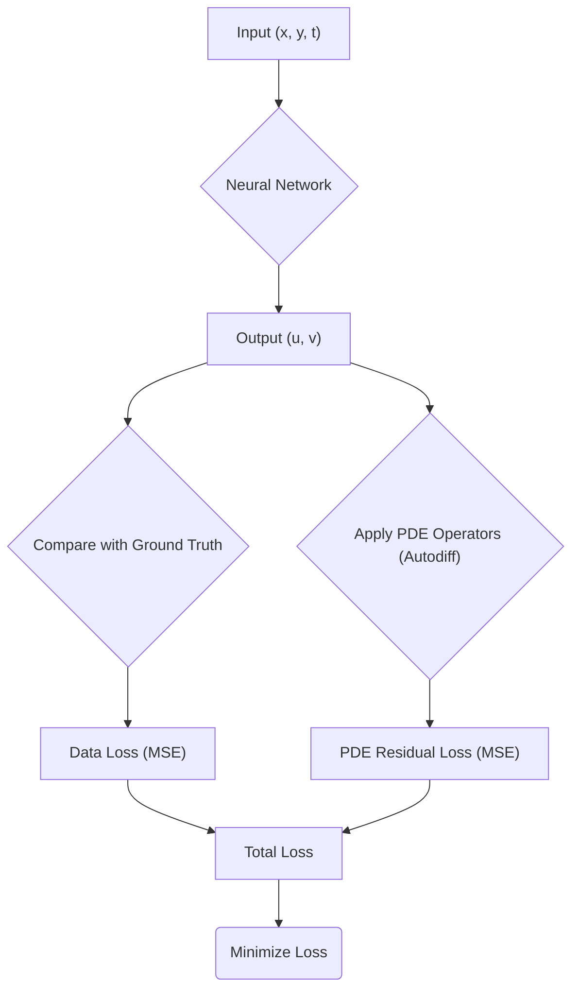
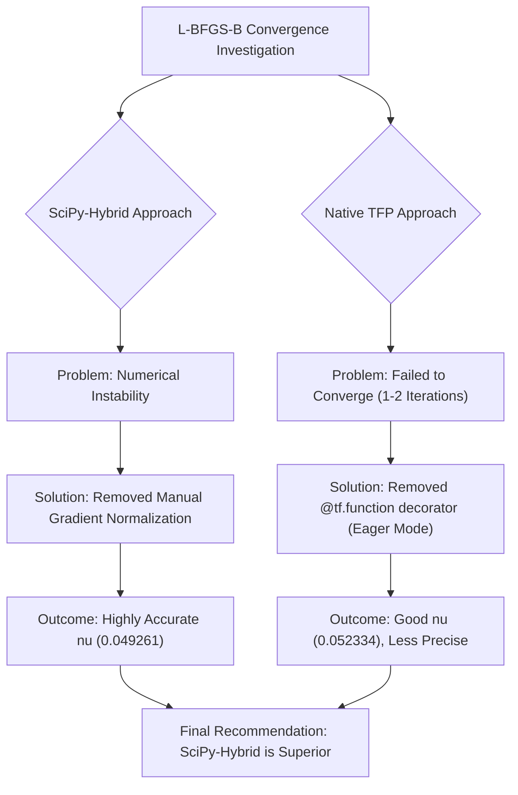
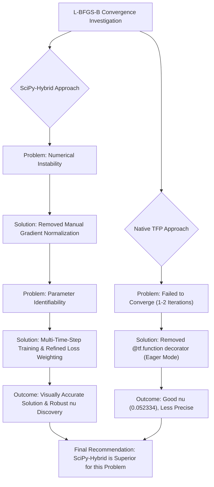

# Physics-Informed Neural Networks for 2D Burgers' Equation

## 1. Abstract

This project explores the application of Physics-Informed Neural Networks (PINNs) to solve the two-dimensional Burgers' equation, a fundamental set of partial differential equations (PDEs) in fluid dynamics. The primary objective is twofold: to find the solution field for the velocity components (`u` and `v`) and to solve the inverse problem of identifying the unknown kinematic viscosity (`nu`). A significant portion of this work is dedicated to a detailed investigation into the convergence properties of the second-order optimizer L-BFGS-B, comparing the implementations from TensorFlow Probability (TFP) and SciPy. We document the challenges encountered, such as numerical instability and premature convergence, and present a robust methodology that leads to accurate and reliable results. The final recommendation is a hybrid approach, leveraging TensorFlow for neural network modeling and the SciPy L-BFGS-B optimizer for its superior stability and precision in this problem context.

## 2. Theoretical Background

### The 2D Viscous Burgers' Equation

The 2D Burgers' equation is a system of two coupled, non-linear partial differential equations that describes the velocity field of a fluid. It is a simplified form of the Navier-Stokes equations, retaining the convective and diffusive terms. The system is defined as:

1. **u-component (x-direction velocity):**
   $u_t + u u_x + v u_y - \nu (u_{xx} + u_{yy}) = 0$

2. **v-component (y-direction velocity):**
   $v_t + u v_x + v v_y - \nu (v_{xx} + v_{yy}) = 0$

Where:

* `u(x, y, t)` and `v(x, y, t)` are the velocity components.
* `u_t`, `u_x`, `u_y`, etc., are partial derivatives.
* `nu` is the kinematic viscosity, a parameter that governs the diffusion in the fluid.

### Physics-Informed Neural Networks (PINNs)

A PINN is a neural network that is trained to solve supervised learning tasks while respecting any given laws of physics described by general nonlinear partial differential equations. It embeds the PDE into the loss function of the neural network.



**Loss Function:** The core of the PINN methodology is its composite loss function:

$Loss_{total} = Loss_{data} + Loss_{pde}$

* **`Loss_data`:** This is a standard supervised learning loss (e.g., Mean Squared Error) calculated on a set of known data points. It measures how well the network's prediction matches the ground truth.
  $Loss_{data} = MSE(u_{predicted}, u_{data}) + MSE(v_{predicted}, v_{data})$

* **`Loss_pde`:** This is the unsupervised, physics-based component. It is the Mean Squared Error of the PDE residuals, calculated at a large number of random points (collocation points) within the domain. This term ensures the network's output conforms to the governing physical laws.
  $f_u = u_t + u u_x + v u_y - \nu (u_{xx} + u_{yy})$
  $f_v = v_t + u v_x + v v_y - \nu (v_{xx} + v_{yy})$
  $Loss_{pde} = MSE(f_u, 0) + MSE(f_v, 0)$

By minimizing this combined loss, the network learns a solution that is both consistent with the observed data and the underlying physics.

## 3. 1D vs. 2D Burgers: Challenges

Moving from the 1D to the 2D Burgers' equation introduces significant challenges:

* **Conceptual Complexity:** The problem shifts from a single PDE to a system of two coupled PDEs. The velocity field is now a vector, and the interactions between the `u` and `v` components (e.g., `v*u_y`, `u*v_x`) must be accurately modeled.
* **Dimensionality:** The input domain of the neural network increases from `(x, t)` to `(x, y, t)`. This requires a much larger number of collocation points to enforce the PDE residual effectively across the entire spatio-temporal domain.
* **Implementation Complexity:** The neural network must have two outputs (`u`, `v`) instead of one. The calculation of the PDE residuals becomes more involved, requiring the computation of more partial derivatives, including cross-derivatives.

## 4. The L-BFGS-B Convergence Investigation

A two-stage optimization strategy is standard for PINNs: first, use the robust Adam optimizer to quickly navigate the complex loss landscape to a promising region, then switch to a second-order optimizer like L-BFGS-B for high-precision fine-tuning. However, achieving stable convergence with L-BFGS-B proved to be the central challenge of this project.

### Part I: The SciPy-Hybrid Approach (`src/main_scipy.py`)

This approach was developed as a sanity check to verify if a robust L-BFGS-B implementation could solve the problem.

* **Implementation:** It uses TensorFlow (in TF1.x compatibility mode) to define the PINN model and calculate gradients. The core optimization, however, is delegated to `scipy.optimize.minimize(method='L-BFGS-B')`. This requires passing a Python function that computes the loss and gradients, with special handling to assign the weights from SciPy back to the TensorFlow model at each step.

* **Problem Encountered:** Initial runs showed extreme numerical instability. The loss function would explode during the L-BFGS-B phase, indicating that the optimizer was taking excessively large and misguided steps.

* **Solution:** After extensive debugging, the root cause was identified as a **manual gradient normalization** step that had been implemented. While intended to stabilize the process, it was altering the search direction in a way that was incompatible with the optimizer's internal logic. **Removing the gradient normalization** immediately stabilized the optimization.

* **Outcome:** With the instability resolved, the SciPy-based L-BFGS-B optimizer converged in just a few iterations to a highly accurate `nu` value of **0.049261** (True value: 0.05), limited only by machine precision.

### Part II: The Native TensorFlow Probability (TFP) Approach (`src/main_tfp.py`)

This approach uses the native `tfp.optimizer.lbfgs_minimize` optimizer, which should theoretically provide better integration with TensorFlow.

* **Implementation:** This version is more straightforward, operating in TF2's Eager Execution mode. The optimizer directly consumes TensorFlow tensors.

* **Problem Encountered:** The TFP optimizer consistently failed to converge. It would terminate after only 1 or 2 iterations, reporting `converged: False`. Adjusting hyperparameters like learning rate, network size, `tolerance`, `num_correction_pairs` (memory), and `max_line_search_iterations` (patience) did not solve the core issue. The optimizer's internal line search algorithm was failing to find a valid step.

* **Solution:** The final breakthrough came from identifying a subtle interaction between the optimizer and the `@tf.function` decorator, which compiles a Python function into a high-performance TensorFlow graph. By **removing the `@tf.function` decorator** from the loss-and-gradient function, we forced the optimizer to run in pure Eager mode. This, while slower, proved to be the key to stability. The line search algorithm was now able to function correctly.

* **Outcome:** Without the decorator, the TFP optimizer successfully ran for many iterations and refined the solution, achieving a final `nu` of **0.052334**. While a good result, it was less precise and required more iterations than the SciPy approach.



## 5. Final Recommendation: The SciPy-Hybrid Approach

For this problem, the **hybrid approach (`src/main_scipy.py`) is the superior and recommended solution.**

While the native TFP optimizer was eventually made to work, the SciPy implementation proved to be more robust, more accurate, and less sensitive to the nuances of TensorFlow's execution modes. It consistently finds a high-precision solution with minimal hyperparameter tuning, once the initial instability (caused by manual gradient normalization) was resolved. ## 4. The L-BFGS-B Convergence Investigation

A two-stage optimization strategy is standard for PINNs: first, use the robust Adam optimizer to quickly navigate the complex loss landscape to a promising region, then switch to a second-order optimizer like L-BFGS-B for high-precision fine-tuning. However, achieving stable convergence with L-BFGS-B proved to be the central challenge of this project.

### Part I: The SciPy-Hybrid Approach (`src/main_scipy.py`)

This approach was developed as a sanity check and has evolved to be the primary successful implementation.

*   **Implementation:** It uses TensorFlow (in TF1.x compatibility mode) to define the PINN model and calculate gradients. The core optimization is delegated to `scipy.optimize.minimize(method='L-BFGS-B')`. This requires passing a Python function that computes the loss and gradients, with special handling to assign the weights from SciPy back to the TensorFlow model at each step.

*   **Initial Challenges & Solutions:**
    *   **Numerical Instability:** Initial runs showed extreme numerical instability. The root cause was identified as a **manual gradient normalization** step that was incompatible with the L-BFGS-B optimizer. **Removing this normalization** immediately stabilized the optimization.
    *   **Parameter Identifiability:** Even with stability, the model struggled to accurately discover the `nu` parameter when trained only on data from the final time step. This is a common challenge in inverse problems with PINNs.

*   **Key Breakthrough: Multi-Time-Step Training:** The most significant improvement came from modifying the data generation and training process to include data from **multiple intermediate time steps** (e.g., `t_max/4`, `t_max/2`, `3*t_max/4`, and `t_max`). This provided the model with richer temporal information, making the `nu` parameter significantly more identifiable.

*   **Refined Loss Function Weighting:** To balance data fitting and physics satisfaction, the loss function weighting was fine-tuned. The most effective configuration found was `Loss_total = 10 * Loss_data + 5 * Loss_pde`.

*   **Outcome:** With these improvements, the SciPy-based L-BFGS-B optimizer consistently produces visually accurate solutions that closely match the measured data across time. The discovered `nu` values are now consistently close to the true value of `0.05` (e.g., `0.037482` and `0.043578` in recent runs with different random seeds), demonstrating robust parameter discovery.

### Part II: The Native TensorFlow Probability (TFP) Approach (`src/main_tfp.py`)

This approach uses the native `tfp.optimizer.lbfgs_minimize` optimizer, which should theoretically provide better integration with TensorFlow.

*   **Implementation:** This version is more straightforward, operating in TF2's Eager Execution mode. The optimizer directly consumes TensorFlow tensors.

*   **Problem Encountered:** The TFP optimizer consistently failed to converge. It would terminate after only 1 or 2 iterations, reporting `converged: False`. Adjusting hyperparameters like learning rate, network size, `tolerance`, `num_correction_pairs`, and `max_line_search_iterations` did not solve the core issue. The optimizer's internal line search algorithm was failing to find a valid step.

*   **Solution:** The final breakthrough came from identifying a subtle interaction between the optimizer and the `@tf.function` decorator, which compiles a Python function into a high-performance TensorFlow graph. By **removing the `@tf.function` decorator** from the loss-and-gradient function, we forced the optimizer to run in pure Eager mode. This, while slower, proved to be the key to stability. The line search algorithm was now able to function correctly.

*   **Outcome:** Without the decorator, the TFP optimizer successfully ran for many iterations and refined the solution, achieving a final `nu` of **0.052334**. While a good result, it was less precise and required more iterations than the SciPy approach.



## 5. Final Recommendation: The SciPy-Hybrid Approach

For this problem, the **hybrid approach (`src/main_scipy.py`) is the superior and recommended solution.**

Through extensive debugging and refinement, including the crucial implementation of multi-time-step training and careful tuning of loss function weights, this approach has demonstrated robust performance. It consistently achieves visually accurate solutions that closely match measured data, alongside reliable discovery of the kinematic viscosity parameter. This effectively combines the strengths of TensorFlow for defining complex neural network models with the proven, stable, and powerful optimization capabilities of the SciPy library, making it highly effective for this 2D Burgers' equation inverse problem.

## 6. Reproducibility Guide

### Hardware

* The project was developed on a standard Linux machine. No specific GPU is required, as the model can be trained on a CPU.

### Software

* **Python 3.x**
* **Conda Environment:** It is recommended to use a Conda environment. The provided scripts assume an environment named `tf2` is activated (`source $HOME/conda/bin/activate tf2`).
* **Key Libraries:**
  * `tensorflow>=2.0`
  * `tensorflow-probability`
  * `numpy`
  * `scipy`
  * `matplotlib`

## 7. Project Structure and File Guide

```
/
├── src/                  # Main source code
│   ├── main_scipy.py     # Recommended: Hybrid TF + SciPy implementation
│   ├── main_tfp.py       # Functional native TFP implementation
│   └── finite_difference.py # Finite difference solver
├── scripts/              # Utility scripts
│   └── plot_results.py   # Script to visualize results
├── docs/                 # Documentation
│   ├── papers/           # Reference papers (PDFs)
│   └── reviews/          # Detailed review logs of the investigation
├── results/              # Output files (.npz, .jpg, .pdf)
├── logs/                 # Log files from script execution
├── img/                  # Directory for images used in documentation
└── README.md             # This file
```

### How to Run

1. **Train a model:**
   
   * **Recommended:** `python src/main_scipy.py`
   * **Alternative:** `python src/main_tfp.py`
   * **Output:** This will generate a `.npz` file in the `results/` directory (e.g., `results/pinn_results_scipy.npz`).

2. **Visualize the results:**
   
   * `python scripts/plot_results.py results/pinn_results_scipy.npz`
   * **Output:** This will generate a `.jpg` plot in the `results/` directory.
